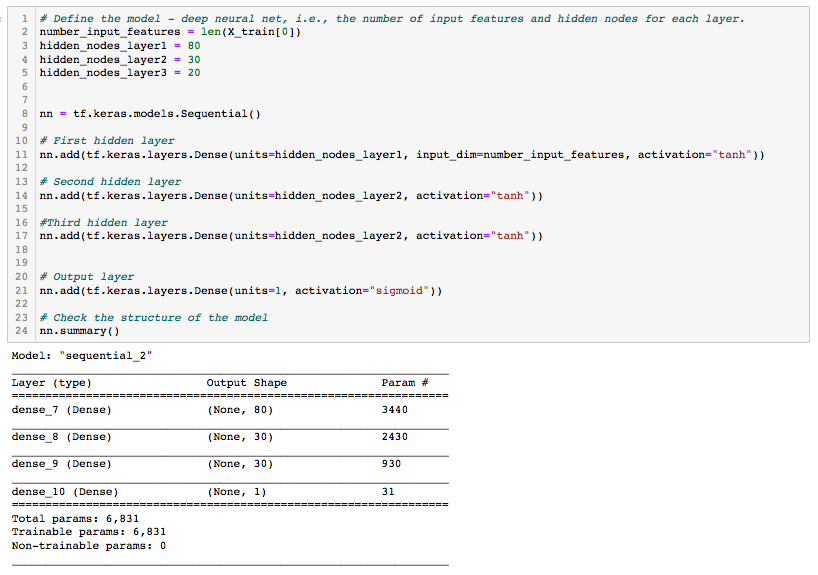

# Neural_Network_Charity_Analysis

# Project Overview
The purpose of this analysis is to use a Neural Network Model to create a model that will assist in identifying nonprofit organizations that are worth donating to and which are high risk.

## Resources
- Data Source: charity_data.csv
- Software: Pyton 3.7, scikit-learn 1.0.1, scipy 1.7.1, numpy 1.20.3, tensorflow 2.6.2

## Results
### Data Preprocessing
- Target Variable: IS_SUCCESSFUL

- Feature Variables: APPLICATION_TYPE, AFFILIATION, CLASSIFICATION, USE_CASE, ORGANIZATION, STATUS, INCOME_AMT, SPECIAL_CONSIDERATIONS, ASK_AMT. (The categorical columns were encoded using OneHotEncoder)
    
- Variables to be removed: EIN, NAME. (The encoded column "SPECIAL_CONSIDERATIONS_N" was also removed due to it's redundancy)

### Compiling, Training, and Evaluating the Model
- The final neural network model consisted of 3 hidden layers, comprised of 80, 30, and 20 neurons, respectively. Each hidden layer employed the tanh function. The model's output layer utilized the sigmoid activation function.

- The model did not achieve the target model performance of 75%. The model's performance was 72.5%.

- Steps taken to attempt to increase the model performance included: removing noisy varibales (SPECIAL_CONSIDERATIONS_N); adding additional neurons and hidden layers; and changing the activation function of the hidden layers from relu to tanh.

## Summary

- The final accuracy of the model was largely unchanged from the initial model at 72.5% (The initial model's accuracy was 72.6%). This is a demonstration of the fact that adding in hidden layers and neurosn does not guarentee that a model's performance will improve.

- Another classification model that may be used to analyze this data is a Random forest model. The random forest model is likely capable of achieving similar accuracy in a fraction of the time and with less code.

